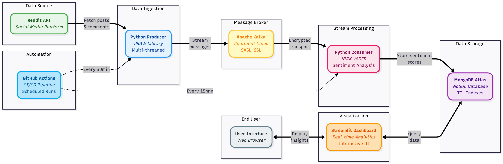

# Reddit Trend Analysis

Real-time sentiment analysis pipeline for Reddit data using Kafka streaming, MongoDB storage, and interactive dashboards.
## Table of Contents
- [Project Goal](#project-goal)
- [Architecture](#architecture)
- [Requirements](#requirements)
  - [Software](#software)
  - [Python Dependencies](#python-dependencies)
- [Setup Instructions](#setup-instructions)
  - [1. Clone Repository](#1-clone-repository)
  - [2. Create Virtual Environment](#2-create-virtual-environment)
  - [3. Download NLTK Data](#3-download-nltk-data)
  - [4. Configure Environment Variables](#4-configure-environment-variables)
  - [5. Configure Subreddits](#5-configure-subreddits)
- [Running the Pipeline](#running-the-pipeline)
  - [Step 1: Start Producer](#step-1-start-producer)
  - [Step 2: Start Consumer](#step-2-start-consumer)
  - [Step 3: Launch Dashboard](#step-3-launch-dashboard)
- [Methodology](#methodology)
  - [Data Collection](#data-collection)
  - [Stream Processing](#stream-processing)
  - [Sentiment Analysis](#sentiment-analysis)
  - [Storage](#storage)
  - [Visualization](#visualization)
- [Automation](#automation)
- [Troubleshooting](#troubleshooting)
- [Future Enhancements](#future-enhancements)

## Project Goal

This project builds an end-to-end data pipeline that:
- Fetches Reddit posts and comments in real-time
- Streams data through Apache Kafka
- Performs sentiment analysis using NLTK VADER
- Stores processed data in MongoDB
- Visualizes trends through an interactive Streamlit dashboard

## Architecture
## Architecture




## Requirements

### Software
- Python 3.10+
- MongoDB Atlas account
- Confluent Cloud Kafka account
- Reddit API credentials

### Python Dependencies
```bash
pip install -r requirements.txt
```

## Setup Instructions

### 1. Clone Repository
```bash
git clone https://github.com/Basim592003/Reddit-Trend-Analysis.git
cd Reddit-Trend-Analysis
```

### 2. Create Virtual Environment
```bash
python -m venv .venv
source .venv/bin/activate  # On Windows: .venv\Scripts\activate
pip install -r requirements.txt
```

### 3. Download NLTK Data
```bash
python -c "import nltk; nltk.download('vader_lexicon')"
```

### 4. Configure Environment Variables

Create `.env` file in root directory:
```
REDDIT_CLIENT_ID=your_client_id
REDDIT_CLIENT_SECRET=your_client_secret
REDDIT_USER_AGENT=your_user_agent

KAFKA_BOOTSTRAP_SERVERS=your_kafka_server
KAFKA_API_KEY=your_api_key
KAFKA_API_SECRET=your_api_secret

MONGO_CONNECTION_STRING=your_mongo_connection_string
```

### 5. Configure Subreddits

Edit `config.yaml` to specify subreddits to monitor:
```yaml
subreddits:
  - technology
  - news
  - worldnews
```

## Running the Pipeline

### Step 1: Start Producer
```bash
cd producer
python reddit_producer.py
```

### Step 2: Start Consumer
```bash
cd consumer
python reddit_consumer.py
```

### Step 3: Launch Dashboard
```bash
python dashboard.py
```

## Methodology

### Data Collection
- Reddit API (PRAW) fetches posts and comments from configured subreddits
- Multi-threaded producer handles rate limiting and continuous streaming
- Data serialized to JSON and published to Kafka topics

### Stream Processing
- Confluent Kafka handles message queuing with SASL_SSL security
- Consumer processes messages in real-time
- Duplicate detection via MongoDB unique indexes

### Sentiment Analysis
- NLTK VADER analyzer computes compound sentiment scores
- Range: -1 (negative) to +1 (positive)
- Scores stored with original post/comment data

### Storage
- MongoDB Atlas stores processed data
- Indexed fields: post_id, subreddit, timestamp, score
- TTL indexes for automatic data cleanup

### Visualization
- Streamlit dashboard provides real-time analytics
- Metrics: sentiment trends, top posts, subreddit comparisons
- Interactive filters and time-based analysis

## Automation

GitHub Actions workflows run automatically:
- **Producer**: Every 30 minutes
- **Consumer**: Every 15 minutes

Manual triggers available via `workflow_dispatch`

## Troubleshooting

**Reddit API Rate Limits:**
- Producer implements exponential backoff
- Reduce subreddit count in config.yaml

**Kafka Connection Issues:**
- Verify credentials in .env
- Check Confluent Cloud cluster status

**MongoDB Storage Limits:**
- Monitor Atlas storage usage
- Implement TTL indexes for cleanup

## Future Enhancements

- Add more sentiment models (transformer-based)
- Implement real-time alerts for viral posts
- Expand to multiple social media platforms
